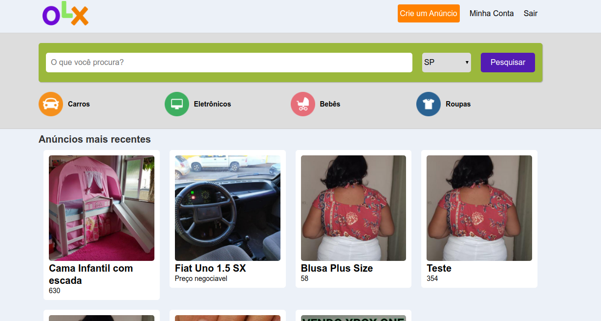
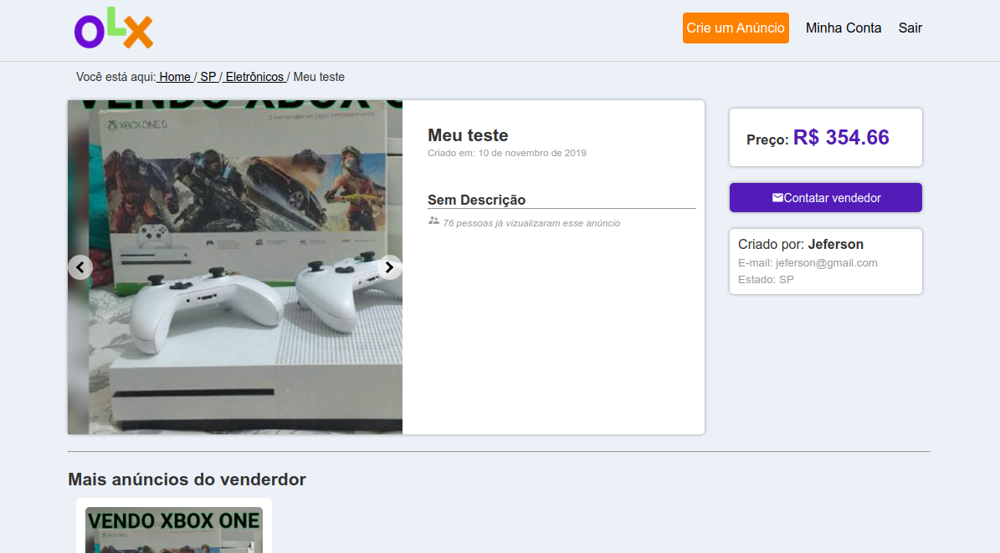

<h1 align="center">
 
  
 
 
Project Dev (OLX - Clone)
</h1>

A project made in ReactJS reproducing the OLX interface

  

## Features

This app features all the latest tools and practices in mobile development!
- ⚛️ **React Js** — A JavaScript library for building user interfaces
- 🔃 **React Router** - A JavaScript library for building routes of navigation
- 🔯 **Redux** - For state control of application
- 💅 **Styled-Components** - To style the interfaces

## License

This project is licensed under the MIT License - see the [LICENSE](https://opensource.org/licenses/MIT) page for details.
